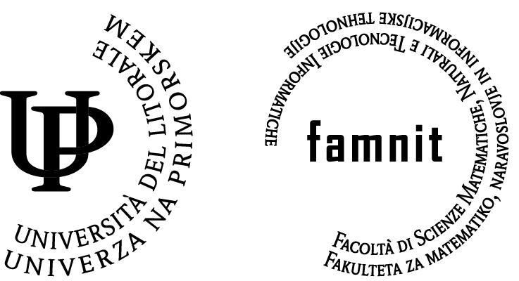
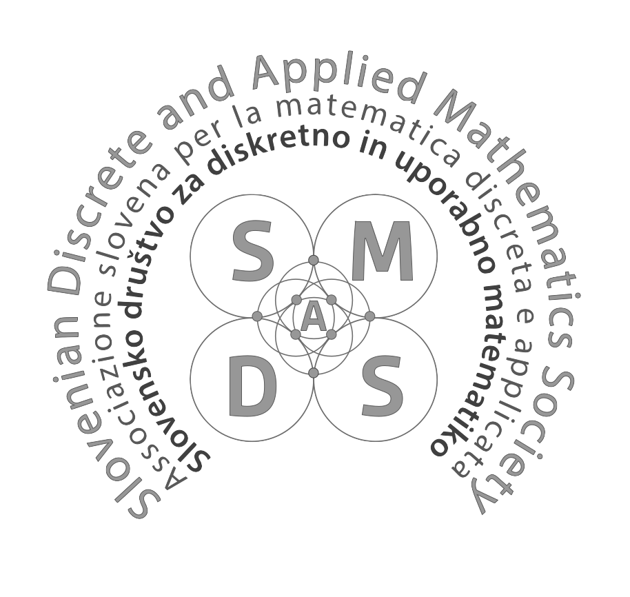
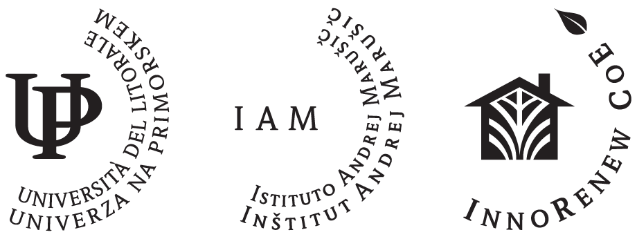

<h1 style="text-align: right;">
Structural Graph Theory Workshop   
on the Adriatic Coast</h1>

**Dates:** August 24–28, 2026  
**Venue:** InnoRenew CoE, Izola, Slovenia  

## About the Workshop

This 5-day workshop aims to foster collaborative discussions and explore various topics in structural graph theory. We intend this event to be small-scale, allowing for focused talks, open problem sessions, and ample time for research discussions among participants. 

Following the spirit of focused mathematical workshops, the event is designed to foster new collaborations in a relaxed yet stimulating environment on the Adriatic coast.

## Organizers

* **Pascal Gollin**
* **Matjaž Krnc**
* **Martin Milanič**

*All organizers are affiliated with the University of Primorska.*

## Organizing Institutions

  
  <!-- FAMNIT -->
  <a href="https://famnit.upr.si" target="_blank">
    <picture>
      <source srcset="assets/FAMNIT-logo-bela.png" media="(prefers-color-scheme: dark)">
      
    </picture>
  </a>

<!-- SDAMS -->
  <a href="https://www.sdams.si/en" target="_blank">
    <picture>
      <source srcset="assets/SDAMS_BC.png" media="(prefers-color-scheme: dark)">
      
    </picture>
  </a>

  <!-- IAM -->
  <a href="https://innorenew.eu/" target="_blank">
    <picture>
      <source srcset="assets/3-logo-RGB-WHITE-03.png" media="(prefers-color-scheme: dark)">
      
    </picture>
  </a>

